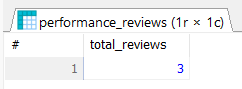
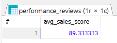
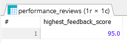
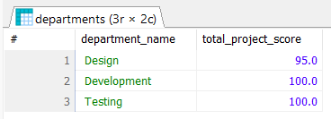
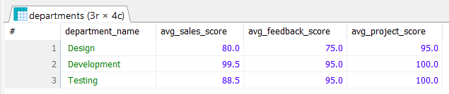
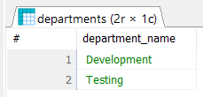
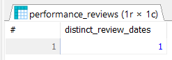
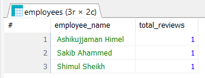
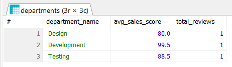

# Lab Report 02
**Course:** Database Management System Sessional (CSEC-322)<br />
**Topic:** Lab Aggregation Function<br />

**Prepared By:**<br />
Ashikujjaman Himel<br />
ID: 2222081021<br />
Batch: 57A Day<br />
Semester: Fall-2024<br />

## Create and Use Database
```sql
CREATE DATABASE abc_company;
USE abc_company;
```

## Create Tables
```sql
CREATE TABLE departments (
	department_id INT PRIMARY KEY NOT NULL AUTO_INCREMENT,
	department_name VARCHAR(50) NOT NULL
);

CREATE TABLE employees (
	employee_id INT PRIMARY KEY NOT NULL AUTO_INCREMENT,
	employee_name VARCHAR(50) NOT NULL,
	department_id INT,
	FOREIGN KEY (department_id) REFERENCES departments(department_id)
);

CREATE TABLE performance_reviews (
	review_id INT PRIMARY KEY NOT NULL AUTO_INCREMENT,
	employee_id INT,
	review_date DATE NOT NULL,
	sales_performance_score DECIMAL(5, 2),
	customer_feedback_score DECIMAL(5, 2),
	project_completion_score DECIMAL(5, 2),
	FOREIGN KEY (employee_id) REFERENCES employees(employee_id)
);
```

## Insert Sample Data
```sql
INSERT INTO departments (department_name)
VALUES ('Design'), ('Development'), ('Testing');

INSERT INTO employees (employee_name, department_id)
VALUES ('Ashikujjaman Himel', 2), ('Shimul Sheikh', 1), ('Sakib Ahammed', 3);

INSERT INTO performance_reviews (employee_id, review_date, sales_performance_score, customer_feedback_score, project_completion_score)
VALUES (1, '2024-09-14', 99.5, 95, 100), (2, '2024-09-14', 80, 75, 95), (3, '2024-09-14', 88.5, 95, 100);
```

## Q1: Total number of performance reviews conducted
```sql
SELECT COUNT(*) AS total_reviews FROM performance_reviews;
```
### Output of Q1


## Q2: Average salse performance score of all employees
```sql
SELECT AVG(sales_performance_score) AS avg_sales_score FROM performance_reviews;
```
### Output of Q2


## Q3: Highest customer feedback score
```sql
SELECT MAX(customer_feedback_score) AS highest_feedback_score FROM performance_reviews;
```
### Output of Q3


## Q4: Total project completion score for each department
```sql
SELECT d.department_name, SUM(pr.project_completion_score) AS total_project_score FROM departments d
JOIN employees e ON d.department_id = e.department_id
JOIN performance_reviews pr ON e.employee_id = pr.employee_id
GROUP BY d.department_name;
```
### Output of Q4


## Q5: Average sales, customer feedback, and project completion scores for each department
```sql
SELECT d.department_name, 
	AVG(pr.sales_performance_score) AS avg_sales_score,
	AVG(pr.customer_feedback_score) AS avg_feedback_score,
	AVG(pr.project_completion_score) AS avg_project_score
FROM departments d
JOIN employees e ON d.department_id = e.department_id
JOIN performance_reviews pr ON e.employee_id = pr.employee_id
GROUP BY d.department_name;
```
### Output of Q5


## Q6: Find the department with an average sales performance score greater than 80
```sql
SELECT d.department_name FROM departments d
JOIN employees e ON d.department_id = e.department_id
JOIN performance_reviews pr ON e.employee_id = pr.employee_id
GROUP BY d.department_name
HAVING AVG(pr.sales_performance_score) > 80;
```
### Output of Q6


## Q7: Count the number of distinct review dates
```sql
SELECT COUNT(DISTINCT review_date) AS distinct_review_dates FROM performance_reviews;
```
### Output of Q7


## Q8: List all employee names along with their total number of reviews
```sql
SELECT e.employee_name, COUNT(pr.review_id) AS total_reviews FROM employees e
JOIN performance_reviews pr ON e.employee_id = pr.employee_id
GROUP BY e.employee_name;
```
### Output of Q8


## Q9: Find the average sales performance and the total number of reviews for each department
```sql
SELECT d.department_name, 
	AVG(pr.sales_performance_score) AS avg_sales_score,
	COUNT(pr.review_id) AS total_reviews
FROM departments d
JOIN employees e ON d.department_id = e.department_id
JOIN performance_reviews pr ON e.employee_id = pr.employee_id
GROUP BY d.department_name;
```
### Output of Q9
